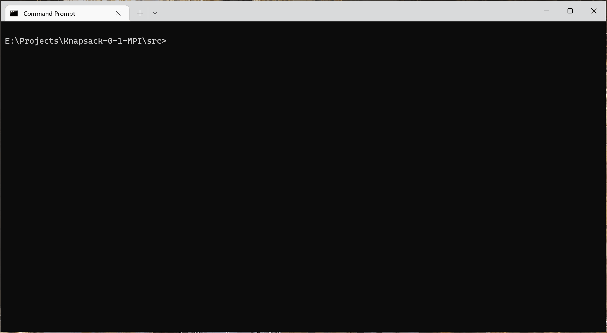

# About
The following project was done to provide an optimal way of solving the 0/1 Knapsack Problem. The implementation uses dynamic programming and parallel computations in the form of multiprocessing.

The project is written in C (for the best performance) and uses the Intel implementation of the MPI standard. Everything is documented in code with comments.

## How it works?
### The problem
The 0/1 Knapsack Problem is a well-known _weakly_ NP-hard ([through a reduction from Partition Problem - section 10.5](https://www.cs.cmu.edu/afs/cs/academic/class/15854-f05/www/scribe/lec10.pdf)), while there exists an implementation that has pseudo-polynomial complexity. It stems from the magnitude of input data, not the number of inputs.

### The solution
To solve this problem the recursive approach was implemented using the [SPMD](https://en.wikipedia.org/wiki/Single_program,_multiple_data) approach. At least 2 processes must be called to run the algorithm.

#### Root
The root node (process with rank 0) distributes tasks which consist in determining a particular knapsack size (from 0 to n) and caches the results into a 1-dimensional array.

#### Workers
The other processes wait for a task from the root node. On a given request, each of them computes the result asynchronously. Each node has its own array of items that can be packed (their weights and values).

However, the results of the computed knapsacks are stored in the root node. Therefore, to find out the value of the previously cached result, a query to the root node is sent. If the result is already calculated, the return message contains the answer. Otherwise, the information returned delays the process because that particular result has not yet been computed.

# Features
Besides the main computations, some small things might be useful.

- Error handling - if the user specifies wrong parameters, the code is designed to handle such situations and provides the potential fix.
- Logging modes - the implementation contains two logging modes made for tracking the process of calculations. These are:
  - `TRACE` - prints verbosely every action that has happened (who sent or received the message, its contents and response to them).
  - `DEBUG` - only prints the results of each iteration of the calculated knapsack size.

   *The reason why the debugging can be set only on the preprocessing stage is to avoid significant performance hit that exists by passing through unused ifs.*
- Custom types - the implementation does **not** force the user to use the hardcoded variable types (default is unsigned long). To do that, change the `VAR_TYPE` macro to the desired one, as well as `MPI_VAR_TYPE`.
  
    **WARNING**: Keep in mind that this type has to be defined by MPI standard!

# Installation
The provided tutorial was tested on Windows machines and it's **dedicated** purely to systems working on Intel CPUs. However, detailed steps on installation are on the [Intel MPI Library site in the "Get Started" section](https://www.intel.com/content/www/us/en/developer/tools/oneapi/mpi-library.html#gs.2t9kdv:~:text=Documentation-,Get%20Started,-Windows).

## Minimal requirements
- Systems based on the Intel® 64 architecture
- 2 GB RAM (1 GB of memory per core)
- 4 GB of free hard disk space
- Visual Studio (2019/2022 version recommended)

## Steps (for Windows)
### Installing
1. Go to the Intel® oneAPI Base Toolkit download site ([link](https://www.intel.com/content/www/us/en/developer/tools/oneapi/base-toolkit-download.html))
2. Install these Intel® OneAPI Base Toolkit tools (3.3 GB):
   - Intel® DPC++ Compatibility Tool
   - Intel® Distribution for GDB
   - Intel® oneAPI DPC++ Library
   - Intel® oneAPI Threading Building Blocks
   - Intel® oneAPI DPC++/C++ Compiler

   
  
   *Disclaimer: It's **highly** recommended to install the tools in the default path. The custom one might lead to issues*

3. Go to the Intel® oneAPI HPC Toolkit download site ([link](https://www.intel.com/content/www/us/en/developer/tools/oneapi/hpc-toolkit-download.html))
4. Install Intel® OneAPI HPC Toolkit tools (115 MB):
   - Intel® MPI Library
   - Intel® oneAPI DPC++/C++ Compiler & Intel® oneAPI C++ Compiler Classic
   
   

    *Disclaimer: The rest of the packages are made mostly for debugging and shorter compilation time. If you wish to install them then go ahead*

5. Add bin directories to the PATH system variable:
   - Path to MPI (*by default, `C:\Program Files (x86)\Intel\oneAPI\mpi\<version>\bin`*)
  
  
  *If the folder contains `hydra_service.exe` then it's the right one!*

   - Path to compiler (*by default, `C:\Program Files (x86)\Intel\oneAPI\compiler\<version>\windows\bin\intel64`*)
  
  
   *If the folder contains `icl.exe` then it's the right one!*

### Configuring
1. Open Command Prompt **as administrator** (cmd)
2. Run the `setvars.bat` file located in the MPI installation directory (*by default, `C:\Program Files (x86)\Intel\oneAPI`*)

   

3. Install & run hydra service (used for network MPI communication)
    ```bash
    hydra-service -install
    hydra-service -start
    ```
   

4.  Register your device to identify it in the MPI network 
    ```bash
    mpiexec -register
    ```
    

5. (*Optional step*) It's highly recommended to restart the PC

### Compiling
Clone this repository by using your favourite client software 😉

#### Manually (*stable, recommended*)
1. Open Command Prompt **as administrator** (cmd)
2. Initialize the environment by running the `setvars.bat` script
   
   ```bash
   "%ONEAPI_ROOT%\setvars.bat"
   ```
   

3. In **the same** (*it's very important*) cmd session go to the project folder
4. Go to the `src` directory (the one containing the `main.c` file)
5. Compile the project by typing
   ```bash
   mpiicc -o output.exe main.c
   ```
   

1. You've installed and compiled the project successfully 🎉!

#### By using Visual Studio (*unstable, **not** recommended*)
The reason why this solution is unstable, is the high possibility of compilation failures. The most well-known reason is installing the project on the **other** drive than the MPI is installed.

1.  Open the directory with the cloned project and double click on the `.sln` file

    *Disclaimer: The project has already configured settings. If you want to configure your very own project, [here](https://www.intel.com/content/www/us/en/develop/documentation/mpi-developer-guide-windows/top/compiling-and-linking/configuring-a-visual-studio-project.html) is the link to the instruction*

2.  Click ***Project*** > ***Intel Compiler*** > ***Use Intel oneAPI DPC++/C++ Compiler*** if it's not already in use. After that your project in the Solution Explorer will have the compiler name in curly brackets

    

3.  (*Optional step*) Click ***Project*** > ***(...) Properties***
4.  (*Optional step*) Ensure that everything in the configuration is set properly ([according to the documentation](https://www.intel.com/content/www/us/en/develop/documentation/mpi-developer-guide-windows/top/compiling-and-linking/configuring-a-visual-studio-project.html))
5.  (*Optional step*) Save and close the settings
6.  Change the Solution Platform to "x64"
7.  Click ***Build*** > ***Build Solution*** or press F7
8.  You've installed and compiled the project successfully 🎉!

## Launching application
1. In Command Prompt type:
   ```bash
   mpiexec -n <number of processes> <path to the compiled project file> <args>
   ```

    **Protip**: Without the `-n` parameter, mpiexec will automatically determine the amount of the installed core and use all of them

    - Running using the `TRACE` option
      
      
      

    - Running using the `DEBUG` option
      
      
      

    - Running on default settings
      
      
      

2. You've launched the project successfully 🎉!

## Trouble?
*Typical, annoying with no explanations MPI error...*


It's very common to encounter errors if You've installed the MPI environment on the **other** drive than the project files are located! 

### Missing DLL files (for manual comiling)
`The code execution cannot proceed because impi.dll was not found.`


The message implies that the executable was unable to locate the missing DLL. It is a [well-known behaviour](https://stackoverflow.com/a/4953976) when it comes to the DLL files and the workaround is provided below.

There's a probability that it happens when the Intel® oneAPI toolkit and the project are installed on **separated** drives.

#### Solution
Copy the missing DLL files from the MPI directory.
1. Open Command Prompt **as administrator** and open open the folder with the `main.c` file
2. Copy the missing DLL by typing:
   
   ```bash
   copy "%I_MPI_ONEAPI_ROOT%\bin\release\impi.dll" .
   ```
   

3. The problem should be fixed now 👷‍♂️.

### Fatal error in PMPI_Init

The reason why this error happens is the bad initialization of MPI environment variables. It's a very common error that pops right after pasting the DLL in the project directory.

#### Solution
1. In the same Command Prompt you have opened type:
   ```bash
   "%ONEAPI_ROOT%\setvars.bat"
   ```
   

2. The problem should be fixed now 👷‍♂️.

### It just doesn't work...
Use the [stable solution](#manually-stable-recommended). This one always works and if it's not, then You either don't have an Intel CPU or you did something wrong during the installation process.

### I cannot connect to the other servers!
Disable the **private** firewall on each node. That's the simpliest solution.
   
# Authors
- Hubert Lewandowski (_RooTender_)
- Łukasz Zaleski (_lukasz340_)
